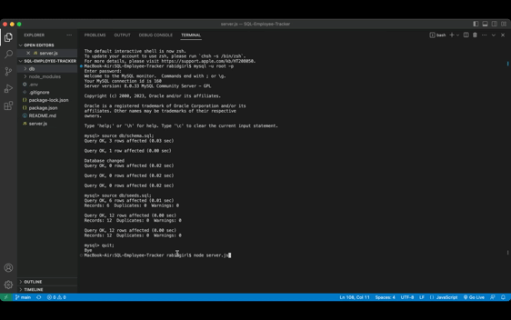

# SQL-Employee-Tracker
Name
 
SQL: Employee Tracker
 
 
Description
 
When the application is started then you are presented with the following options: view all departments, view all roles, view all employees, add a department, add a role, add an employee, and update an employee role.
 
 
When view all departments is chosen then you are presented with formatted table showing department names and department ids.
 
 
When view all employees is chosen then you are presented with a formatted table showing employee data, including employee ids, first names, last names, job titles, departments, salaries, and managers that the employees report to.
 
 
When add a role is chosen then you are prompted to enter the name, salary, and department for the role and that role is added to the database.
 
 
When add an employee is chosen then you are prompted to enter the employee’s first name, last name, role, and manager, and that employee is added to the database. 
 
 
When update an employee role is chosen then you are prompted to select an employee to update and their new role and this information is updated in the database. 
 
 
Badges
 
 
Visuals
 

 
 
Project Repo/Screencastify
 
[Elias Rivera GitHub Repo](https://github.com/eliasjrivera/SQL-Employee-Tracker)
 
[Screencastify]()
 
 
Installation
 
The user should clone the repository from GitHub. This application requires Node.js, Inquirer, console.table and mysql2. To start application run `npm start`. To view database from MySQL `run mysql -u root -p`. 
 
 
Usage
  
This application will allow users to view, add, and edit employees, roles, departments, and managers. 
 
 
Support
 
Elias Rivera
eliasjohnrivera@gmail.com
 
 
Roadmap
 
 
Contributing
 
Contributors should read the installation section.
 
 
Authors and Acknowledgment 
 
Elias Rivera
 
 
License
 
 
Project Status 
 
Project is finished. 